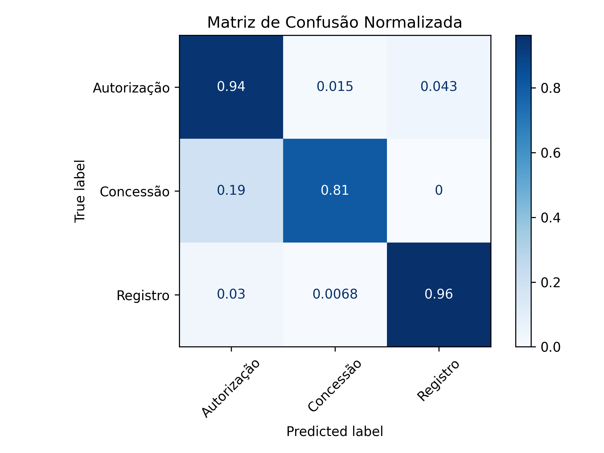
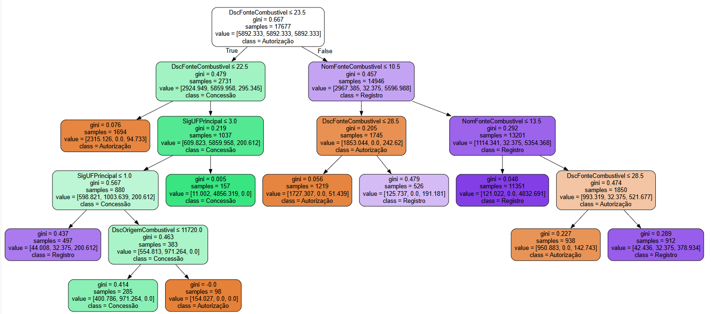
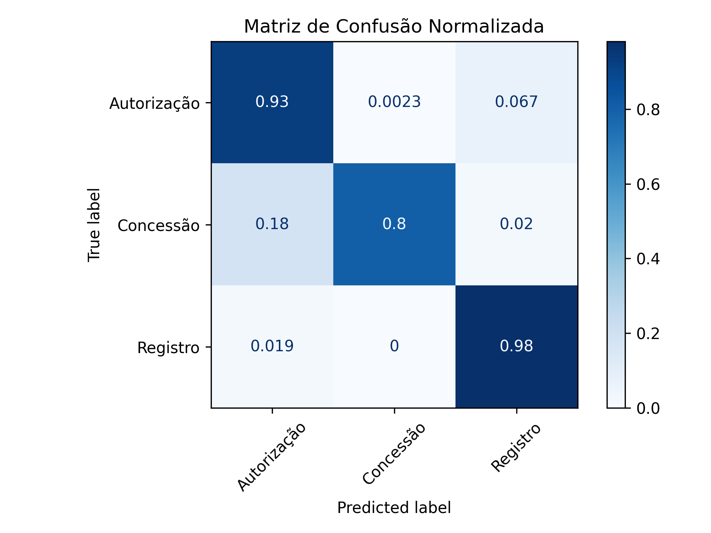
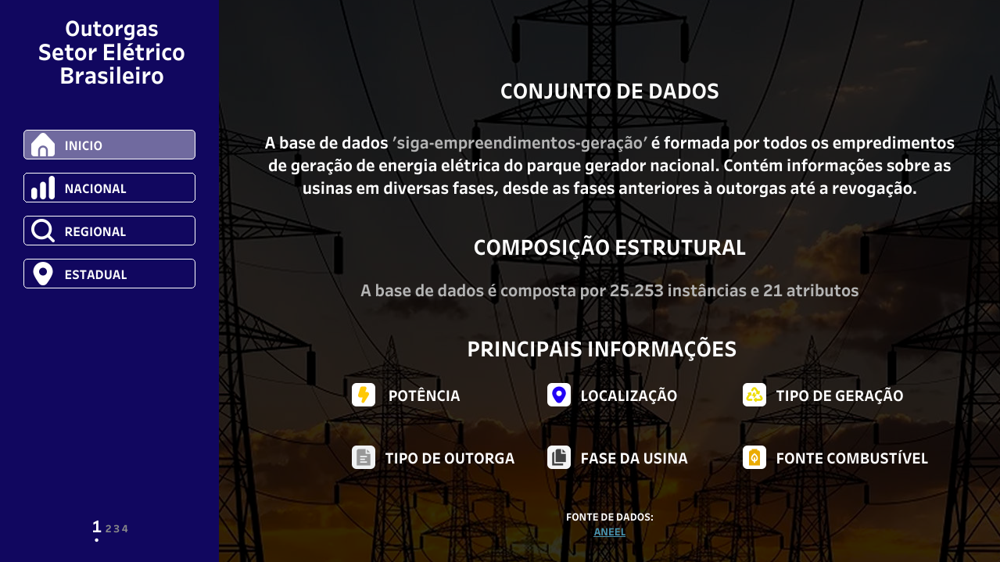
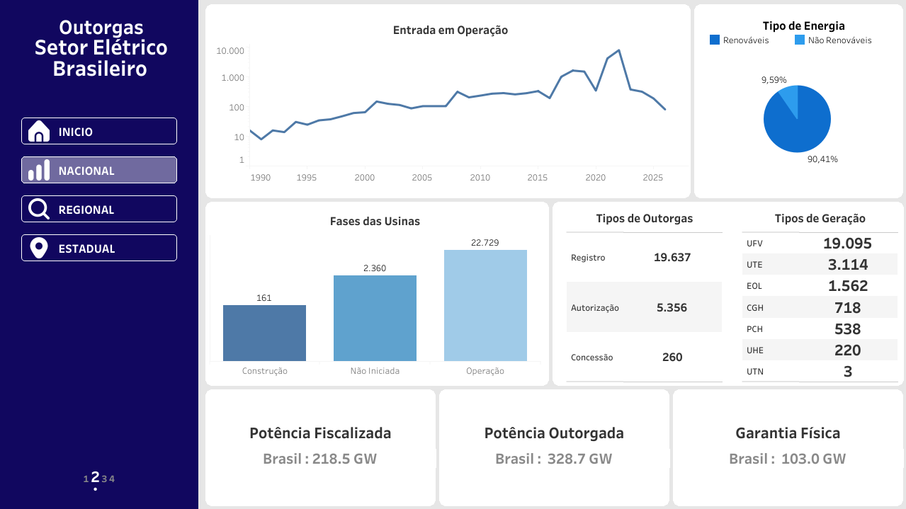
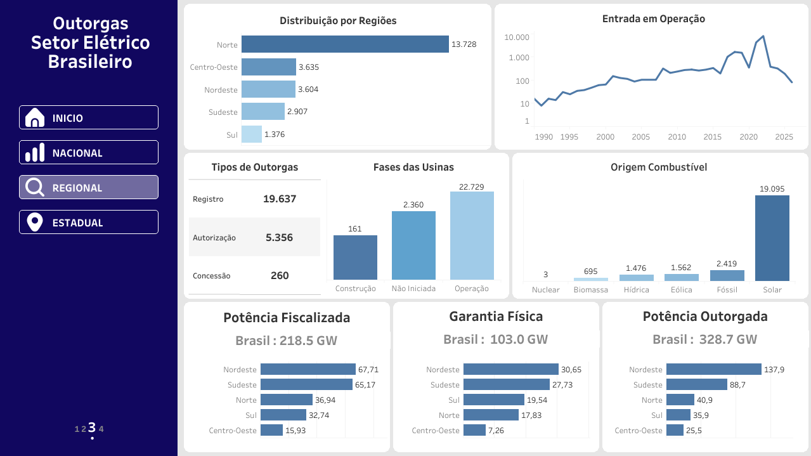
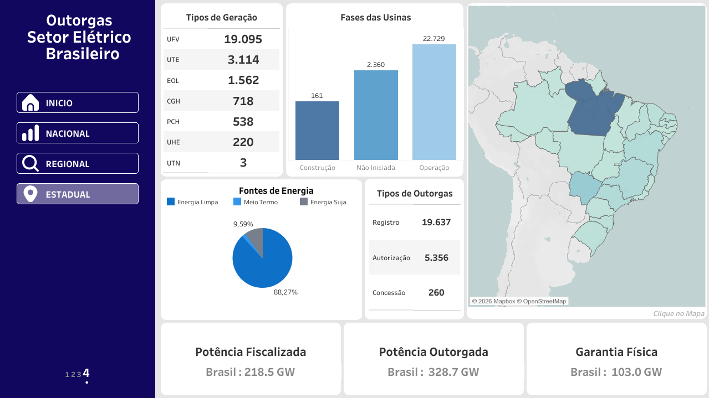

# Outorgas Setor Elétrico Brasileiro

## 📋 Sumário
* [Sobre o Projeto](#-sobre-o-projeto)
* [Estrutura do Repositório](#-estrutura-do-repositório)
* [Tecnologias e Bibliotecas](#️-tecnologias-e-bibliotecas)
* [Base de Dados e Pré-processamento](#️-base-de-dados-e-pré-processamento)
* [Modelos Implementados e Fundamentação](#-modelos-implementados-e-fundamentação)
* [Como Executar o Projeto](#-como-executar-o-projeto)
* [Resultados e Discussão](#-resultados-e-discussão)
* [Dashboard](#-dashboard)

---

## 💡 Sobre o Projeto
O processo de outorga no setor elétrico brasileiro é a autorização formal concedida pela Agência Nacional de Energia Elétrica (ANEEL) para que empresas explorem serviços ou instalações de energia (geração, transmissão e distribuição). 

Esse processo é classificado em três modalidades distintas: 

1. Concessão: Aplicada a serviços públicos prestados com riscos por conta e risco da empresa, geralmente obtida por meio de licitação/leilão (ex: linhas de transmissão e distribuição).

2. Autorização: Utilizada para a exploração de produção de energia, inclusive para uso próprio (autoprodução), e para centrais de armazenamento.

3. Registro: Para empreendimentos de capacidade reduzida ou fontes alternativas que exigem apenas comunicação oficial à ANEEL ou cadastro na Câmara de Comercialização de Energia Elétrica (CCEE).

Nesse sentido, este projeto processa históricos de dados das outorgas do sistema elétrico da ANEEL, executa transformações necessárias nas variáveis e treina modelos de classificação para mapear padrões. 

---

## 📂 Estrutura do Repositório

O projeto está organizado de forma modular para separar a lógica de transformação de dados, as definições dos modelos e a visualização:
```

Sistemas_Eletrico_Brasileiro/ 
├── dados/
│   └── dados_futuros.csv          # Dataset pré-processado
├── img/                           # imagens do README     
├── src/
│   ├── data_transformation/       # Preparação da base de dados
│   │   └── transformation.py
│   ├── decision_tree/             # Modelo de Árvore de Decisão 
│   │   ├── model.py               
│   │   └── train.py               
│   └── random_forest/             # Modelo Random Forest 
│       ├── model.py              
│       └── train.py               
├── style/
│   └── style.css                  # Estilos do dashboard 
├── index.html                     # Importação do dashboard do Tableau
├── main.py                        # Execução principal
├── requirements.txt               # Arquivo de dependências com versões exatas fixadas
└── README.md                      # Documentação completa do projeto
```
---

## 🛠️ Tecnologias e Bibliotecas
As principais ferramentas utilizadas no desenvolvimento deste ecossistema foram:

* **Python :** Linguagem base para implementação do projeto.
* **Pandas:** Utilizado para manipulação de DataFrames, tratamento dos dados.
* **Numpy:** Implemntação das operações matemáticas.
* **Scikit-Learn:** Framework para divisão de dados (train/test split), extração de métricas de validação e implementações dos modelos de ML.
* **Matplotlib:** plotagem da matriz de confução de metricas de avaliação dos modelos. 
* **Tableau:** Plataforma de Business Intelligence utilizada para construir os dashboards interativos.
* **HTML5 & CSS3:** Importação e visualização do dashboard.

---

## ⚙️ Base de Dados e Pré-processamento

Os dados já foram pré-processados via google colab e salvos no formato dados_futuros.csv. 

Pré-Processamento 

1. **Limpeza de Dados:** Remoção de registros duplicados e remoção de colunas irrelevantes para os modelos.
2. **Codificação das Variáveis Categóricas:** Aplicação do LabelEncoder da biblioteca Scikit-Learn.preprocessing para transofarmar valores categóricos em númericos.
3. **Divisão dos Dados:** Separação do dataset em conjuntos de treino e teste (70% treino e 30% teste).

Atributos

`NomFonteCombustivel`,`SigUFPrincipal`,`SigTipoGeracao`,`MdaGarantiaFisicaKw`,`DscFonteCombustivel` , `DscOrigemCombustivel`

Variável alvo

 `TipodeOutorga`

---

## 🤖 Modelos Implementados e Fundamentação

### 1. Random Forest (Floresta Aleatória)
O Random Forest é um algoritmo de aprendizado supervisionado baseado em *Ensemble Learning*. Ele constrói múltiplas árvores de decisão durante a fase de treinamento e combina suas predições (via votação majoritária para classificação ou média para regressão).

* **Vantagens:** Alta robustez contra *overfitting*, lida bem com relações não-lineares de alta dimensionalidade e fornece a importância de cada variável (*Feature Importance*).
* **Hiperparâmetros Ajustados:** Número de árvores (`n_estimators`), profundidade máxima (`max_depth`) e critérios de divisão (`criterion='gini`).

### 2. REP Tree (Reduced Error Pruning Tree)

A *Reduced Error Pruning Tree* é uma variação otimizada da árvore de decisão clássica. Ela constrói a árvore utilizando ganho de informação ou redução de variância e, em seguida, aplica a técnica de poda de trás para frente (da base para a raiz).
* **O Processo de Poda:** O algoritmo separa uma parte dos dados de treino como conjunto de validação. Ele avalia o impacto de podar (remover) subárvores específicas; se a remoção da subárvore não diminuir a precisão no conjunto de validação, a subárvore é substituída por uma folha.
* **Vantagens:** Gera modelos altamente interpretáveis, visualmente limpos, muito mais rápidos na inferência e imunes a ramos ruidosos.

---

## 🚀 Como Executar o Projeto

Os próximos passos descrevem com executar o projeto:

### 1. Clonar o Repositório
```bash
1. git clone [https://github.com/seu-usuario/nome-do-repositorio.git](https://github.com/seu-usuario/nome-do-repositorio.git)
2. cd Sistema_Eletrico_Brasileiro
```
### 2. Instale as dependências:
```
pip install -r requirements.txt
```
### 3. Execute os scripts de treinamento
```
python src/random_forest/train.py
python src/decision_tree/train.py
```
## 📊 Resultados e Discussão

Os modelos foram avaliados utilizando métricas de desempenho. Abaixo estão os resultados comparativos:

### REP Tree

<div align="center">
  
</div>

### Análise da Matriz de Confusão Normalizada

 • Diagonal Principal (Verdadeiros Positivos): O maior destaque é a classe Concessão, com 97% de acertos, seguida por Registro (95%) e Autorização (86%). O balanceamento dos dados contribuiu significativamente para a alta taxa de acertos na classe minoritária (Concessão).

 • Falsos Positivos: O modelo demonstra excelente especificidade em alguns pontos, como não confundir Registro com Concessão (0%). Por outro lado, classifica erroneamente cerca de 7,3% das Autorizações como Concessão e 6,7% como Registro

 • O Impacto no Resultado: Como o volume de processos de Autorização é majoritário na base de dados, esses 7,3% de erro direcionados para a classe menor geram um volume de alarmes falsos que infla a coluna de predição. Isso derruba a precisão de Concessão para 35%, embora o modelo apresente um ótimo desempenho (sensibilidade) na captura de quase todas as concessões reais.

#### Importância 

|Posição |Preditores  | Nível de Importância (%) |
|------- |:------------- |:-------------:|
|1° |`NomFonteCombustivel` |  0.672796     |
|2° |`SigUFPrincipal`      |  0.252363     |
|3° |`SigTipoGeracao`      | 0.060997     |
|4° |`MdaGarantiaFisicaKw` |   0.013844    |
|5° |`DscFonteCombustivel` |  0.000000     |
|6° |`DscOrigemCombustivel`| 0.000000     |


#### Análisando as Variáveis de Importância

• A variável `NomFonteCombustivel` é dominante, sendo que mais de 67% da capacidade da árvore de separar as classes vêm das regras criadas a partir dela.

• A variável `SigUFPrincipal`também apresenta forte relevância, indicando que os fatores de localização geográfica dos empreendimentos contribuem significativamente para a diferenciação dos processos.

• As variáveis `SigTipoGeracao` e `MdaGarantiaFisicaKw` possuem menor impacto, contribuindo apenas no refinamento de alguns nós específicos da árvore.

• As variáveis `DscFonteCombustivel` e `DscOrigemCombustivel` apresentam importância zerada (0%), pois trazem as mesmas informações mapeadas pela variável dominante `NomFonteCombustivel`.


### Árvore Podada Gerada pelo modelo 

<div align="center">
  
</div>

#### Interpretação da Árvore Gerada 

```
Raiz (DscFonteCombustivel)

 • Partindo da raiz da árvore, o modelo utiliza como primeiro critério de divisão o valor <= 23.5:

 • Condição (True): O fluxo vai para à esquerda, onde o modelo tenta isolar e classifcar os casos de outorgas entre Consessão e Autorização. 

 • Condição (False):  O fluxo vai para à direita, onde a maioria dos dados são destinas as outorgas de Registros. 

```

#### Precisão do Modelo 

|Classe (Alvo) | Precisão | Recall |F1-Score|Suporte|
|-------|-------|-------|-------|-------|
|`Autorização`|0.89|0.86|0.8|1.607|
|`Concessão`|0.41|0.97|0.58|78|
|`Registro`|0.98|0.95|0.96|5.891|
|`Acurácia Geral (Accuracy)`|-|-|0.93|7.576|
|`Macro Average`|0.74|0.93|0.79|7.576|
|`Weighted Average`|0.94|0.93|0.93|7.576|

 • Acurácia Geral (0.93): O modelo acerta 93% de todas as classificações que faz na base de teste, somando as três classes.

 • Macro Average (F1-Score: 0.79): É a média simples do desempenho das três classes. Como dá peso igual a todas, mostra que o modelo vai bem mesmo na classe com poucos dados (`Concessão`)

 • Weighted Average (F1-Score: 0.93): É a média ponderada que leva em conta o tamanho de cada classe (Suporte).  Como reflete a proporção real da base de dados, isso vai em encontra com os 93% da acurácia observados.
 
 • Observação: Mesmo com a aplicação de técnicas de balanceamento, a classe `Concessão` obteve um valor baixo de precisão. Isso evidencia que o modelo apresenta limitações para desempenhar com alta assertividade em variáveis (classes) que possuem poucas observações na base de dados, gerando um volume expressivo de falsos positivos. 

### Random Forest 

<div align="center">
  
</div>

### Análise da Matriz de Confusão Normalizada

 • Diagonal Principal (Verdadeiros Positivos): O maior destaque fica para a classe Registro, com 98% de acertos, seguida por Autorização (93%) e Concessão (80%). O modelo demonstra uma excelente capacidade de identificação correta nas três categorias. 

 • Falsos Positivos e Confusões: Embora a taxa de acerto para a classe Concessão tenha sido ligeiramente menor em comparação ao Rep Tree, nota-se que o erro mais expressivo ocorre quando o modelo confunde Concessão com Autorização (18%). Ainda assim, o modelo se mostra mais robusto e equilibrado, evitando penalizar excessivamente as demais classes.

 • Impacto no Resultado: Diferentemente do REPTree, esse modelo apresenta maior precisão geral e um ajuste mais refinado para a classificação das demandas de outorgas.

#### Importância 

|Posição |Preditores  | Nível de Importância (%) |
|------- |:------------- |:-------------:|
|1° |`SigUFPrincipal`       | 0.397117   |
|2° |`MdaGarantiaFisicaKw`  | 0.232564   |
|3° |`NomFonteCombustivel`  | 0.135554   |
|4° |`SigTipoGeracao`       | 0.086731   |
|5° |`DscFonteCombustivel`  | 0.080691   |
|5° |`DscOrigemCombustivel` | 0.067343   |

#### Análisando as Variáveis de Importância 


• A variável `SigUFPrincipal` é o preditor mais relevantes, onde aproximadamente 40% de toda a capacidade preditiva e das divisões das árvores de decisão dependem dessa variável.

• As variáveis `MdaGarantiaFisicaKw` é o segundo preditor mais relevantes, junto com a primeira variável acumuam mais de 60% de todo o modelo. 

• A variável `NomFonteCombustivel` tem uma importãncia moderada para o gerar as árvore do modelo. 

• As variáveis ``SigTipoGeracao``, `DscFonteCombustivel` e `DscOrigemCombustivel` apresentam uma importância menor para a construção do modelo.

#### Precisão do Modelo 

|Classe (Alvo) | Precisão | Recall |F1-Score|Suporte|
|-------|-------|-------|-------|-------|
|`Autorização`              | 0.93 | 0.92  | 0.93 | 1347 |
|`Concessão`                | 0.87 | 0.82  | 0.85 |  67  |
|`Registro`                 | 0.98  |0.98  | 0.98 | 4900 |
|`Acurácia Geral (Accuracy)`|-      |-     | 0.97 | 6314 |
|`Macro Average`            | 0.93  | 0.91 | 0.92 | 6314 |
|`Weighted Average`         | 0.97  | 0.97 | 0.97 | 6314 |

 • Acurácia Geral (0.97): O modelo acerta 97% de  todas as classificações feitas na base de dados.

 • Macro Average (F1-Score: 0.92): É a média simples do desempenho das três classes. Um scode 91 mostra que o modelo aprendeu os padrões reais da base de dados. 

 • Weighted Average (F1-Score: 0.97): É a média ponderada que leva em conta o tamanho de cada classe.  Com valor de 0.97 mostra que o modelo consolidou a eficácia na classificação dos dados reais.  

## Conclusões

O modelo Random Forest mostrou-se superior ao REPTree, apresentando maior eficiência e um comportamento de classificação das classes-alvo muito mais equilibrado do que a abordagem inicial da árvore de decisão podada.

O principal ganho do modelo foi a estabilização da classe Concessão, além do salto na acurácia geral, que atingiu 97%. 

## 🎯 Dashboard 

Dashboard interativo com dados históricos de outorgas do setor elétrico 
brasileiro (ANEEL). 

As análises estão sub-divididas entre os cenários nacional, estadual e regional. 


**Fonte dos dados:** [ANEEL](https://dadosabertos.aneel.gov.br/dataset/siga-sistema-de-informacoes-de-geracao-da-aneel/resource/25722a60-194d-4234-ab3b-b71354078402)

**Ferramenta:** [Tableau]

**Dashboard:** [Outorgas Setor Elétrico Brasil](https://lucasvinisan.github.io/Sistema_Eletrico_Brasileiro/)

**Início**

<div align="center">
  
</div>

**O que o dashboard mostra:**
- Introdução sobre o problema e apresentação da base de dados. 

**Visão Nacional**

<div align="center">
  
</div>

**O que o dashboard mostra:**
- Entrada em Operação das Usinas no Brasil 
- Tipos de geração (UFV, UTE, EOL, CGH, PCH, UHE, UTN)
- Fases das usinas (construção, não iniciada, operação)
- Tipos de Energia (Energia Renóvaveis ou Não Renováveis)
- Tipos de outorgas (registro, autorização, concessão)
- Potência fiscalizada, outorgada e garantia física por em nível Nacional

**Visão Regional**

<div align="center">
  
</div>

**O que o dashboard mostra:**
- Distribuição por regiões  
- Tipos de geração (UFV, UTE, EOL, CGH, PCH, UHE, UTN)
- Fases das usinas (construção, não iniciada, operação)
- Tipos de outorgas (registro, autorização, concessão)
- Potência fiscalizada, outorgada e garantia física em nível Regional
- Ranking por regiões e/ou os cinco estados melhor ranqueado de cada região selecionada 

**Visão Estadual**

<div align="center">
  
</div>

**O que o dashboard mostra:**
- Mapa selecionável do Brasil (Estados)  
- Tipos de geração (UFV, UTE, EOL, CGH, PCH, UHE, UTN)
- Fases das usinas (construção, não iniciada, operação)
- Tipos de outorgas (registro, autorização, concessão)
- Fontes de Energia (Energia Limpa, meio termo e Suja)
- Potência fiscalizada, outorgada e garantia física em nível Regional


## Conclusões

implementação deste dashboard otimizou o processo de consulta sobre as outorgas no Brasil, transformando dados complexos em indicadores visuais intuitivos. A ferramenta não apenas mapeia os estados com maior potencial elétrico, mas também evidencia as disparidades regionais e o fluxo de concessões, servindo como base para o planejamento estratégico de novos investimentos na matriz energética nacional.